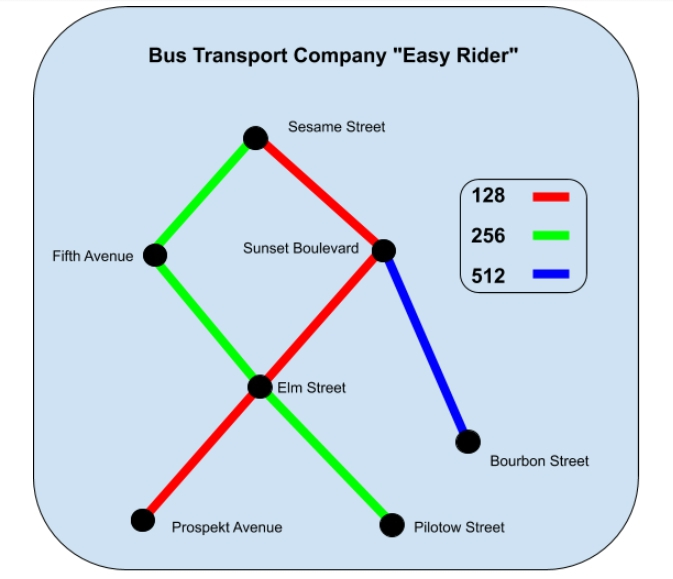

# The program for checking the database of the company "Easy Rider".
>_(Task from [JetBrains Academy](https://hyperskill.org "JetBrains Academy") - track: Python Core)_

We have a database in json format, the database may contain data in an incorrect format. Our task is to check the
correctness of the data. We have two documents to verify the data, the first is the **documentation**, the second is
the **diagram of the bus lines**.We enter a string (we can also use a .json file) containing the data in JSON format,
passed to standard input.

**Documentation:**

**Diagram of the bus lines:**



**Database specification:**


**Example of input data.**
```
[
    {
        "bus_id": 128,
        "stop_id": 1,
        "stop_name": "Prospekt Avenue",
        "next_stop": 3,
        "stop_type": "S",
        "a_time": "08:12"
    },
    ...
]
```

**Run the program**
```commandline
python easyrider.py -f "some_file.json" -v "type_of_checks"
```
or
```
python easyrider.py --file "some_file.json" ---verification "type_of_checks"
```

**The types of checks:**
1. Check that the data types match. Check that the required fields are filled in.
```commandline
command line arg: "data_type"
```
2. Check that the data format complies with the documentation.
```commandline
command line arg: "format_fields"
```
3. Verify the number of stops for each line.
```commandline
command line arg: "bus_info"
```
4. Make sure each bus line has exactly one starting point and one final stop.
```commandline
command line arg: "stops_info"
```
5. Check that the arrival time for the upcoming stops for a given bus line is increasing.
```commandline
command line arg: "time_errors"
```
6. Check that all the departure points, final stops, and transfer stations are not "On-demand".
```commandline
command line arg: "demand_errors"
```
